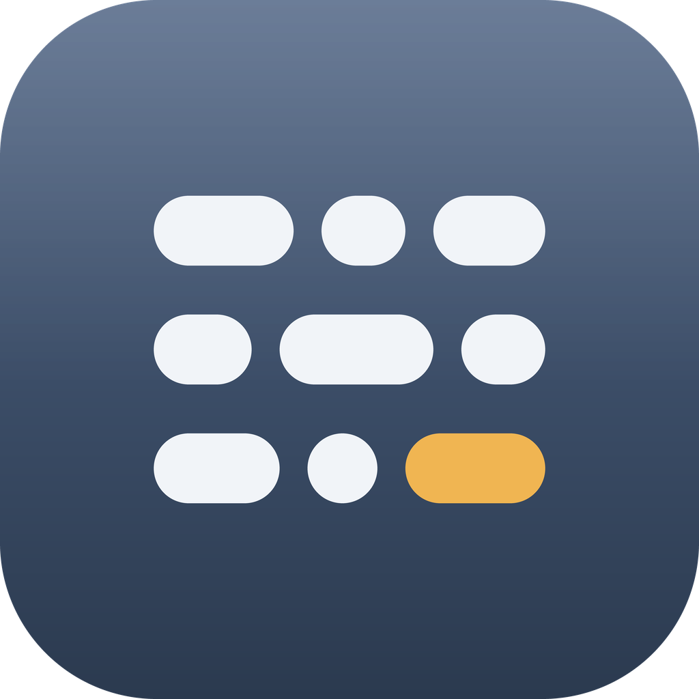
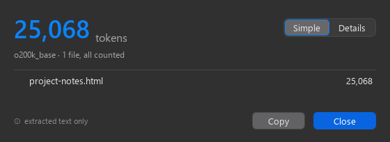
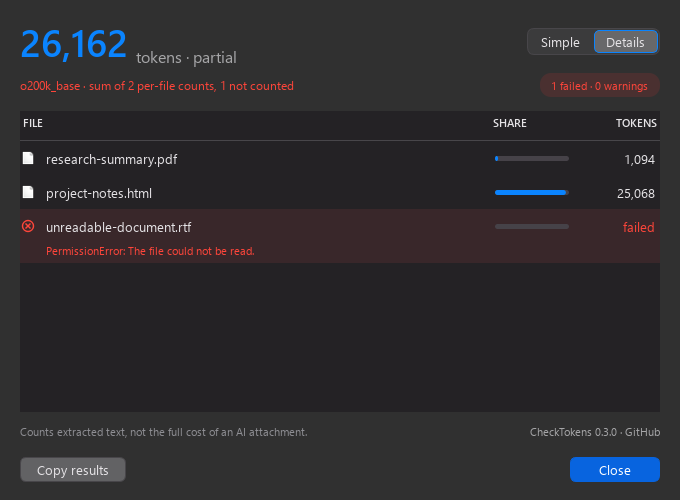

# CheckTokens

Count text tokens locally, straight from Finder or Windows Explorer. Select files, right-click, choose **Check Tokens**, and get individual counts and a total in one native window. macOS may group the item under **Services** when many services are available.

macOS 15+ (Apple Silicon and Intel) · Windows 10 x64 (build 19044+) · No account or API key · Offline

## Version 0.3.1

CheckTokens now has its own application icon on both platforms, in Finder and the Dock, in Explorer's context menu and the Windows taskbar, and as a small mark before the name in the **Details** footer. See the [changelog](CHANGELOG.md) for the release changes.

**Simple** keeps the total and per-file results compact:



**Details** adds share bars and inline diagnostics, including partial results:



These previews render the actual Windows widgets with synthetic example data; the system title bar is omitted.

## Install on Windows

Download `CheckTokens-windows-x64.zip` from [Releases](https://github.com/NivailoPL/checktokens/releases) when published, or use the ZIP produced by the build below. Extract the whole archive and double-click **install.cmd**. Do not run it inside the ZIP viewer. Installation needs neither administrator privileges nor Python, and works offline from the complete ZIP.

The application is installed in `%LOCALAPPDATA%\Programs\CheckTokens\current\app`, with a Start menu shortcut and a **Check Tokens** command for files in Explorer. Select one or many files: each invocation opens one combined report. Windows 11 uses **Show more options**; integration with its modern menu is deferred and Windows 11 has not yet been manually verified.

The Windows window follows the macOS design: a blue token total, **Simple / Details** segmented control, progress, cancellation and complete/partial status. Simple is compact; Details adds file icons, share bars and inline errors/warnings beneath each filename. Hover a row for its full path and encoding. **Copy results** or `Ctrl+C` copies the report. `Ctrl+1` / `Ctrl+2` switch views; `Esc` cancels counting or closes a finished window; `Enter` closes a finished window. Opening CheckTokens from Start lets you choose files.

The default appearance is dark, matching the macOS reference. Right-click the window background to choose **Dark** or **Light**; only that preference is saved. Windows retains its standard title bar and window controls. Text uses the system's Segoe UI font and scales with display DPI.

Close CheckTokens before updating, then run `install.cmd` from a newly extracted ZIP. You can delete the downloaded ZIP and extracted package after installation. Uninstall by running `%LOCALAPPDATA%\Programs\CheckTokens\current\uninstall.cmd`. Unrelated files are preserved. Scripts use Windows PowerShell 5.1 with an execution-policy override for that process only; they do not change the system policy.

The initial Windows package is unsigned. Windows may show a publisher/reputation prompt; managed-device policies can prevent it from running. No global security setting changes are required by the installer.

The packaged CLI is `current\app\checktokens-cli.exe`, for example:

```powershell
& "$env:LOCALAPPDATA\Programs\CheckTokens\current\app\checktokens-cli.exe" --json -- 'C:\Documents\notes.md'
```

## Install on macOS

Download the appropriate ZIP from [Releases](https://github.com/NivailoPL/checktokens/releases), extract it, and run its installer from Terminal:

```sh
bash /path/to/extracted/install-macos.sh
```

Alternatively, download or clone this repository, then run:

```sh
bash install-macos.sh
```

The repository installer downloads the **v0.3.1** package for your Mac and verifies its SHA-256. It requires that release's assets to have been published; pushing source code alone does not publish an installable package. Until then, use a published release's installer or build locally. The extracted-package installer checks the included content manifest. Python, Homebrew and developer tools are **not** required for installation.

Installation is per user, without `sudo`. The app lives in `~/Library/Application Support/CheckTokens/CheckTokens.app`; the workflow lives in `~/Library/Services/Check Tokens.workflow`. You can move/delete the downloaded repository or ZIP after installation. Run the installer again to replace an existing CheckTokens installation.

The app is **ad hoc signed**, without Apple Developer ID or notarization. If macOS blocks its first launch, open the installed `CheckTokens.app` and follow [Apple's Open Anyway instructions](https://support.apple.com/en-us/102445). Do not disable Gatekeeper globally. Opening the app directly also lets you select files using a file picker.

If the action is missing, reopen the Finder menu and check **Finder → Services** with files selected. No accessibility or full-disk-access permission is needed for counting normally accessible files.

## What gets counted

The bundled **o200k_base** tokenizer counts extracted text. This is **not** a universal token count across all models or the full cost of uploading an attachment to an AI service. The total is the sum of per-file counts, not a count of concatenated files or conversation overhead.

| Input | Content |
| --- | --- |
| TXT, Markdown, code, JSON, YAML, CSV, logs | Decoded source text, including syntax and whitespace |
| HTML, XML | Source with markup, not rendered browser text |
| RTF | Text without RTF formatting commands |
| DOCX | Main paragraphs, tables (including nested tables), unique headers and footers |
| PDF | Extracted text in page order |

- Text files can have unfamiliar extensions or no extension. UTF-8 and Unicode BOMs are supported; other encodings are detected heuristically and explicitly marked for verification. No lossy decoding is used.
- DOCX text boxes, tracked changes, footnotes, endnotes and comments are not fully extracted. Their presence produces an explanatory note and marks the total partial.
- PDF extraction can change spacing or reading order. Pages without extracted text are reported; a fully textless PDF reports that OCR may be needed. This does not prove a page is a scan. OCR and password entry are not included.
- Files that fail, unsupported binary formats and directories get their own errors. Remaining files are still counted. A valid empty text file has zero tokens.
- A total is marked **partial** when any file failed or has extraction/encoding warnings.
- Limits: **50 MiB per file**, **30 seconds per file**, and **100 MiB expanded DOCX content**. Exceeding a limit fails the file rather than silently truncating it.
- OCR, alternate tokenizers and automatic updates are deferred.

Documents are never modified or uploaded. CheckTokens has no telemetry or document history and does not write extracted text to disk. **Copy results** copies the report to your clipboard only when clicked.

## Command line

```sh
uv run checktokens -- document.md notes.rtf
uv run checktokens --json -- document.pdf
uv run checktokens --gui -- document.md notes.rtf
```

Without `uv`, invoke the installed app's binary:

```sh
"$HOME/Library/Application Support/CheckTokens/CheckTokens.app/Contents/MacOS/checktokens" --json -- document.md
```

JSON contains `tokenizer`, `files` (path, tokens or null, error, warnings, encoding), `total_tokens`, `counted_files`, and `complete`. CLI exit codes: **0** complete, **1** partial/failed, **2** invalid arguments, **130** interrupted. GUI document errors are shown in its window and do not trigger a second Automator error dialog.

## Uninstall on macOS

```sh
bash "$HOME/Library/Application Support/CheckTokens/uninstall-macos.sh"
```

Only CheckTokens-owned files are removed. Other files in the installation directory are preserved.

## Development

### Windows build

Install [uv](https://docs.astral.sh/uv/) and Visual Studio Build Tools with **Desktop development with C++** (MSVC and Windows SDK). From an **x64 Native Tools** prompt in this repository:

```powershell
uv sync --locked
uv run pytest -q
uv run ruff check .
uv run ruff format --check .
uv run python scripts/build_windows.py
uv run python scripts/smoke_windows.py dist/CheckTokens-windows/checktokens-cli.exe
```

Alternatively pass `--compiler C:\path\to\llvm-mingw\bin\x86_64-w64-mingw32-clang++.exe` to the build script. Local development was built with LLVM-MinGW 20260826 (LLVM 23.1.0); the compiler is not included in the application. Build output: `dist/CheckTokens-windows-x64.zip` and `dist/SHA256SUMS-windows`. SHA-256 detects package corruption; it is not a publisher signature.

Windows uses PySide6/Qt Widgets (Essentials), two PyInstaller executables sharing bundled libraries, and a small native COM local server (`IExecuteCommand` / `IObjectWithSelection`, `MultiSelectModel=Player`). The server transfers UTF-8 JSON paths through a unique current-user-only named pipe (length-prefixed, acknowledged, timeout-bound); document content is never written to the pipe or disk. Each invocation has its own channel and window. The server exits after its clients release it and a short idle period. Registration is per-user under `HKCU\Software\Classes`.

Run `uv run python scripts/preview_windows.py` to render both views and both themes with synthetic successful, failed and warning results into `work/ui-preview`. This renders real widgets offscreen, without opening or copying user documents. Set `QT_SCALE_FACTOR=1.5` or `2` to verify fractional/high-DPI rendering.

The Windows CI job builds with MSVC and checks the packaged CLI with outbound networking blocked. Installer tests use isolated temporary paths and private registry roots. Windows 10 Explorer/UI acceptance remains distinct from hosted Windows Server CI. macOS tests continue in their original jobs. `.gitattributes` protects tokenizer data from Git newline conversion on Windows.

### macOS build

Install [uv](https://docs.astral.sh/uv/), then:

```sh
uv sync --locked
uv run pytest -q
uv run ruff check .
uv run ruff format --check .
uv run python scripts/build_macos.py
uv run python scripts/smoke_bundle.py dist/CheckTokens.app/Contents/MacOS/checktokens
bash install-macos.sh --package dist/CheckTokens-macos-arm64.zip
```

Use `x86_64` instead of `arm64` for Intel. Build on macOS 15 for the supported minimum target. Local development on a newer macOS produces a locally verifiable build, while release packages come from the macOS 15 CI jobs. Installation tests compile a tiny fixture and therefore require Xcode Command Line Tools; end users do not need them.

### Icon

`src/checktokens/mark.py` holds the mark geometry. The results footer draws it live through AppKit and Qt, so it stays sharp on any display, and `uv run python scripts/make_icons.py` re-renders `assets/icon` from the same numbers: `checktokens.icns` for the Mac bundle, `checktokens.ico` for both Windows executables and the Explorer verb, and a 1024 px PNG. Marks below 40 points drop to two blocks per row, which keeps 16 and 32 px legible. Rendering is deterministic and a test compares the committed files against the current geometry, so run the script after changing `mark.py`. Writing `.icns` needs `iconutil` from macOS; elsewhere the committed file is left as it is.

Dependencies are pinned in `uv.lock`. Tokenizer data and its SHA-256 are committed. Normal builds never download tokenizer data; the explicit developer maintenance script `scripts/vendor_tokenizer.py` refreshes it from the pinned upstream library.

GitHub Actions tests, builds and runs the packaged CLI with **network access denied** for both Mac architectures and Windows x64. It uploads ZIPs and SHA-256 files as workflow artifacts; publication is a separate release step. For a release, wait for all three jobs on the release commit, combine the two Mac checksum files into one `SHA256SUMS`, and attach it alongside both Mac ZIPs. Attach `CheckTokens-windows-x64.zip` and its `SHA256SUMS-windows` separately.

Verification: native window and packaged CLI tested locally on Apple Silicon/macOS 26.5.2. CI covers macOS 15 ARM and Intel; check the workflow result for the exact release commit. Intel Finder UI has not been manually verified.

Windows verification: installed app and registered Explorer COM command tested on Windows 10 Pro x64 build 19044, including multi-file selections, Simple/Details and a failed-file report. Real-widget previews cover dark/light themes at 100%, 150% and 200% scaling. The packaged CLI was checked with DOCX/PDF/RTF, Unicode paths and an empty tokenizer cache. Windows 11 and macOS 0.3.1 still require platform-specific acceptance checks.

## License

MIT. See [THIRD_PARTY_NOTICES.md](THIRD_PARTY_NOTICES.md) for bundled dependencies.
